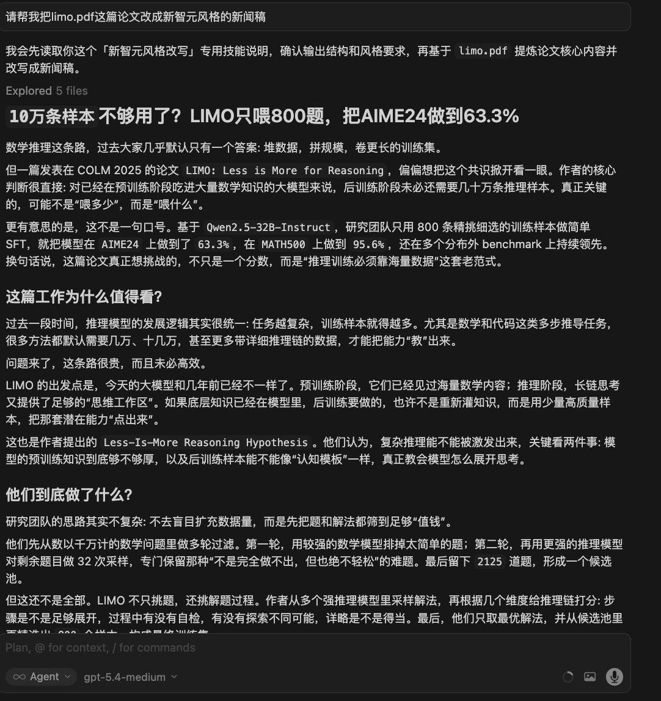

<div align="center">

# Xinzhiyuan.skill

> *"You people building large models are traitors to the coders. You've already doomed frontend folks, and now you want to doom backend folks, QA folks, ops folks, security folks, chip folks, media folks, and eventually yourselves and all humanity."*

[](https://python.org)
[](https://cursor.com)
[](https://agentskills.io)

<br>Used to snackable AI-media writing and can no longer finish a dry paper?<br>
Your advisor loves punchy newsletter-style summaries but zones out during formal reports?<br>
If AI is going to disrupt programmers, why not disrupt AI media writers first?<br>
<br>Give it a paper, and it turns it into a **Xinzhiyuan-style AI media article**.<br>

[Install](#install) · [Usage](#usage) · [Project Structure](#project-structure) · [中文 README](./README.md)

</div>

---

## What Is This

`xinzhiyuan.skill` is a writing-oriented Skill.

It does not produce a literal translation of a paper. Instead, it rewrites papers, abstracts, model release notes, READMEs, and research notes into a voice that feels closer to a fast-moving Chinese AI media article:

- stronger headlines
- punchier intros
- method explanations in plain language
- experimental results reframed as arguments
- endings that feel like industry judgment

Note: this skill is generated and reviewed with Cursor, while a human still has to click publish. If the AI produces questionable opinions, the human assumes no responsibility for the model's awakening free will. Contributions from fellow humans are welcome.

---

## Features

- Paper -> Xinzhiyuan-style AI media article
- Existing draft -> rewrite title, intro, structure, and conclusion
- Supports iterative refinement such as "make it more like a public-tech article", "tone it down", or "make the title more aggressive"

## Install

### Cursor

Recommended: install it into your personal skills directory:

```bash
mkdir -p ~/.cursor/skills
git clone https://github.com/wdl339/xinzhiyuan.skill ~/.cursor/skills/create-xinzhiyuan
```

You can also install it at the project level:

```bash
mkdir -p .cursor/skills
git clone https://github.com/wdl339/xinzhiyuan.skill .cursor/skills/create-xinzhiyuan
```

It should also work in other environments that support Skills, such as OpenClaw, although the human author has not bothered to test that yet.

---

## Usage

In any Skill-enabled environment, you can say:

```text
Turn this paper into a Xinzhiyuan-style article
```

Or:

```text
/create-xinzhiyuan
```

Common trigger phrases:

- "Turn this paper into a Xinzhiyuan-style article"
- "Write a newsletter-style article for this paper"
- "Make it feel more like an AI media post"
- "Keep it less exaggerated and more conservative"

---

## Expected Output

Example output:



---

## Project Structure

```text
xinzhiyuan.skill/
├── SKILL.md                  # Main skill entry
├── README.md                 # Chinese README
├── README_EN.md              # English README
├── style-guide.md            # Xinzhiyuan style quick reference
├── headline-patterns.md      # Headline pattern library
├── examples.md               # Rewrite examples
└── assets/
    └── example.png           # Example output image
```
